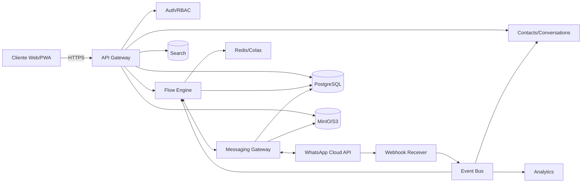

# NexIA — Fundamentos y PRD (v0.1)

[](https://github.com/pixelgrimoire/nexia/actions/workflows/ci.yml) [](https://github.com/pixelgrimoire/nexia/actions/workflows/e2e-smoke.yml)

[Developer quick commands](docs/DEVELOPER_COMMANDS.md) — common local setup & test commands.

> **Nombre tentativo**: *NexIA*. Plataforma SaaS para automatizar WhatsApp (y luego otros canales) con IA y flujos sin código, diseñada para PYMEs y equipos de ventas/soporte.

---

## 1) Visión y propuesta de valor
**One‑liner**: Responde en segundos, escala atención y ventas por WhatsApp con flujos visuales y IA, manteniendo cumplimiento y métricas claras.

**Pilares**
- **No‑code primero**: editor de flujos visuales para disparadores, condiciones y acciones.
- **IA responsable**: clasificación de intención, extracción de datos y respuestas con guardrails.
- **Omnicanal (futuro)**: WhatsApp → Instagram/FB Messenger/Email/SMS.
- **Métricas accionables**: conversiones, tiempo de respuesta, conversaciones nuevas, ahorro de horas.
- **Cumplimiento**: políticas de WhatsApp, privacidad y auditoría.

**No‑objetivos (v0/v1)**
- No ser un CRM completo, sino conectarse a uno.
- No proveer discador telefónico ni PBX.

---

## 2) Personas y casos de uso
**Dueño de PyME**: quiere responder 24/7, clasificar leads, enviar catálogo y derivar a un humano.

**Agente de atención/ventas**: necesita inbox unificado, respuestas rápidas, plantillas, notas y etiquetas.

**Administrador/Operaciones**: configura flujos, plantillas aprobadas, horarios, integraciones y ve reportes.

---

## 3) Onboarding (alto nivel)
1. **Registro**: email, contraseña, nombre del negocio.
2. **Conexión de canal** (dos modos):
   - **Oficial**: **WhatsApp Cloud API (recomendado)** → crear WABA/app, token, webhook URL, número verificado, plantillas.
   - **Bridge / Linked Devices**: lectura/escritura vía dispositivo vinculado. *Riesgos*: límites, estabilidad, posibles incumplimientos; sólo para mercados donde Cloud API no esté disponible.
3. **Primeros pasos**: importar contactos, activar flujo “Hola 👋 + Calificador de intención + Catálogo”, definir horario y handoff a humano.

---

## 4) Requisitos funcionales (MVP)
- **Autenticación & Tenancy**: organizaciones, workspaces, usuarios, roles (Owner, Admin, Agent, Analyst).
- **Conexión WhatsApp**: gestión de credenciales (Cloud API) o emparejamiento (Bridge), verificación de estado.
- **Contactos**: atributos, etiquetas, opt‑in/opt‑out, consentimiento, timeline de eventos.
- **Plantillas**: alta, variables, estados (draft/approved), categorías (marketing/utility/authentication).
- **Editor de flujos sin código**: nodos (Trigger, Condition, Intent, Action, Delay, Wait for Reply, Escalation, Webhook, Set Attribute, A/B), versionado y publicación.
- **Bandeja/inbox**: asignación, estados (open/pending/closed), notas internas, adjuntos.
- **IA/NLP**: intent classifier, extractores (nombre, email, producto), sugerencias de respuesta, base de conocimientos (RAG) opcional.
- **Handoff a humano**: reglas por horario/intención/tiempo, notificaciones (web/push/email).
- **Métricas y reportes**: volumen, tasa de respuesta, conversaciones nuevas, tiempo medio, embudo de flujos.
- **Integraciones**: **Webhooks** salientes, claves API, conectores simples (Google Sheets/CRM genérico mediante webhook).
- **Auditoría**: logs de acciones, cambios de flujo, envíos de mensajes.

**V1+** (posterior)
- Campañas y segmentación, scheduler, A/B testing.
- Integraciones nativas (HubSpot, Shopify, WooCommerce).
- Multicanal (IG, FB Messenger), conocimiento/FAQ avanzado, reglas de asignación por skills.

---

## 5) Requisitos no funcionales
- **Multi‑tenant** seguro (aislamiento lógico por organización).
- **Escalabilidad horizontal** en mensajería y webhooks.
- **Latencia** baja para eco/respuesta (<1–2 s en interacción síncrona) y colas para tareas lentas.
- **Disponibilidad** con colas/reintentos idempotentes.
- **Observabilidad**: logs estructurados, métricas, trazas.
- **Backup/Restore** de BD y objetos.

---

## 6) Arquitectura propuesta (referencia)
**Frontend**: Next.js (App Router), PWA, Tailwind + shadcn/ui, auth con Auth.js; WebSockets/SSE para inbox en tiempo real.

**Backend** (microservicios orientados a dominios):
- **API Gateway** (FastAPI): auth, rate‑limit, validación, RBAC.
- **Messaging Gateway (WhatsApp)**: envío/recepción, gestión de plantillas y media, políticas 24h, reintentos.
- **Webhook Receiver**: endpoint público para eventos de Meta; verificación de token; fan‑out a bus de eventos.
- **Flow Engine**: ejecución de flujos (state machine), scheduler de delays/esperas, almacenamiento de runs.
- **NLP/IA Service**: intent classification, extractores, RAG (conocimiento), safety guardrails.
- **Contacts & Conversations**: CRUD, búsqueda, timeline, etiquetado.
- **Analytics**: agregaciones, KPIs, exportaciones.
- **Integrations**: Webhooks salientes, librería de conectores.

**Infra recomendada**: PostgreSQL (OLTP), Redis (colas, locks, cache), MinIO/S3 (media), worker queue (Celery/RQ), bus de eventos (Redis Streams/RabbitMQ), OpenSearch/Meilisearch (búsqueda), Nginx/Traefik como edge, Prometheus + Grafana + Sentry.



---

## 7) Modelo de datos (esquema lógico)
- **Organization**: id, name, plan, billing_status.
- **User**: id, org_id, email, role, 2FA, status.
- **Channel**: id, org_id, type=whatsapp, mode=cloud|bridge, status, credentials (k/v), phone_number.
- **Contact**: id, org_id, wa_id/phone, name, attributes (JSONB), tags[], consent, locale, timezone.
- **Conversation**: id, org_id, contact_id, channel_id, state(open/pending/closed), assignee, last_activity_at.
- **Message**: id, conversation_id, direction(in|out), type(text|media|template), content(JSONB), template_id?, status(delivered/read/failed), meta.
- **Template**: id, org_id, name, language, category, body, variables, status.
- **Flow**: id, org_id, name, version, graph(JSON), status(draft/published), created_by.
- **FlowRun**: id, flow_id, contact_id, state, started_at, finished_at, logs(JSONB).
- **Event/Audit**: id, org_id, actor, action, target, payload, ts.
- **Webhook**: id, org_id, url, secret, events[], retry_policy.

---

## 8) Motor de flujos (no‑code)
**Tipos de nodo**
- **Trigger**: mensaje entrante, palabra clave, horario, nuevo contacto, clic en enlace, apertura de conversación.
- **Condition**: if/else, switch, regex, comparación de atributos.
- **Intent**: enrutado por intención (NLP) o similitud.
- **Action**: enviar mensaje/plantilla/media, set attribute, add/remove tag, call webhook, create task, assign agent, close conversation.
- **Wait**: por respuesta, por tiempo, hasta horario laboral.
- **Escalate**: pasar a humano (inbox, notificación), SLA.
- **A/B**: porcentaje o reglas.

**Contexto y variables**: `contact.*`, `message.*`, `org.*`, `now`, `kv` (corto plazo), `secrets` (sólo lectura).

**Ejemplo de flujo (JSON)**
```json
{
  "name": "Calificador de Leads",
  "version": 1,
  "nodes": [
    {"id":"t1","type":"trigger","on":"message_in"},
    {"id":"n1","type":"intent","model":"fast-intent-v1","map":{
      "precio":"path_precio","catalogo":"path_catalogo","soporte":"path_soporte","default":"path_default"
    }},
    {"id":"a1","type":"action","action":"send_template","template":"saludo_inicial","next":"n1"}
  ],
  "paths": {
    "path_precio": [{"type":"action","action":"send_template","template":"lista_de_precios"}],
    "path_catalogo": [{"type":"action","action":"send_media","asset":"catálogo.pdf"}],
    "path_soporte": [{"type":"escalate","to":"human","queue":"soporte"}],
    "path_default": [{"type":"action","action":"send_text","text":"¿En qué puedo ayudarte?"}]
  }
}
```

---

## 9) WhatsApp: políticas y reglas clave
- **Ventana de 24 horas**: se puede responder libremente si el usuario escribió en las últimas 24 h; fuera de esa ventana se requiere **plantilla aprobada**.
- **Categorías de plantilla**: marketing, utility, authentication; idiomas; variables; aprobación por Meta.
- **Opt‑in/consentimiento**: registrar consentimiento y canal de origen.
- **Calidad y límites**: rating, límites de envío; monitoreo de errores.
- **Media**: almacenar en S3/MinIO, expiración de URLs, saneamiento/antivirus opcional.

---

## 10) Seguridad y cumplimiento
- **Cifrado en tránsito** (TLS) y **en reposo** (discos/DB/objetos con KMS).
- **RBAC** por organización/rol; **scopes** por API key.
- **Auditoría** completa y exportable.
- **Seguridad de secretos**: Vault/SSM, rotación, principio de mínimo privilegio.
- **Privacidad**: minimización de datos, retención configurable, derecho al olvido.
- **Conformidad**: LFPDPPP/GDPR base, Términos de uso, DPA, control de acceso físico/lógico.

---

## 11) Telemetría y KPIs
- **Producto**: tiempo de primera respuesta, conversaciones nuevas, CSAT (reacción o encuesta), tasa de resolución, ahorro de horas, conversión por flujo/plantilla.
- **Plataforma**: errores por endpoint, latencia p95, tasa de reintento, uso por tenant, salud de colas.
- **Alertas**: caída de webhooks, expedición de tokens, baja de calidad del WABA, picos inusuales.

---

## 12) API de plataforma (borrador)
**Autenticación**: Bearer JWT / API Key por organización.

**Ejemplos**
```http
POST /api/messages/send
Content-Type: application/json
{
  "channel_id": "wa_main",
  "to": "+5215555555555",
  "type": "template",
  "template": {"name":"catalogo","language":"es","variables":["Juan"]}
}
```

```http
POST /api/webhooks/whatsapp  (público)
X-Hub-Signature: sha256=...
{
  "object":"whatsapp_business_account",
  "entry":[{"changes":[{"value":{"messages":[{"from":"52155...","text":{"body":"hola"}}]}}]}]
}
```

```http
POST /api/flows/execute
{
  "flow_id": "lead_qualifier_v1",
  "contact_id": "c_123",
  "context": {"source":"ad_campaign_42"}
}
```

---

## 13) Inbox (Handoff a humano)
- Vistas: mías, del equipo, sin asignar, por etiqueta, por prioridad.
- Acciones: responder, aplicar plantilla, notas internas, macros, cerrar, reabrir, reasignar, snooze.
- SLA: semáforos, colas/skills, horarios laborales.

---

## 14) Pricing (borrador conceptual)
- **Plan Starter**: 1 número, N agentes, límite de contactos/conversaciones, reportes básicos.
- **Plan Pro**: múltiples números, flujos avanzados, webhooks, reportes y segmentación.
- **Plan Business**: SSO/SCIM, retención avanzada, auditoría, límites altos, soporte prioritario.
- **Costos de Meta**: traspaso transparente por conversación/plantillas.

---

## 15) Roadmap por fases
- **Fase A (MVP)**: conexión WhatsApp, editor de flujos básico, inbox, métricas esenciales, webhooks, plantillas.
- **Fase B (V1)**: campañas, segmentación, A/B, integraciones nativas.
- **Fase C (V2)**: multicanal, knowledge base avanzada, reglas de enrutamiento por skills.

---

## 16) Calidad, pruebas y despliegue
- **E2E** (Playwright/Cypress) para flujos críticos: onboarding, envío, webhook, handoff.
- **Contract tests** para payloads de WhatsApp.
- **Load tests** para picos de mensajes.
- **Blue/Green** o canary releases; migraciones con Prisma/Alembic.
- **Backups** automatizados y DR.

---

## 17) Operación y SRE
- **Runbooks**: rotura de webhooks, caducidad de token, saturación de colas, bloqueo de número.
- **Alerting**: canales (PagerDuty/Slack/Email), umbrales, on‑call.
- **Tareas programadas**: limpieza de media, compaction, archivado.

---

## 18) Riesgos y mitigaciones
- **Cambios de políticas de WhatsApp** → seguimiento y flags de features.
- **Baneo/quality drop por spam** → límites, monitoreo, warm‑up, verificación de opt‑in.
- **Hallucinations de LLM** → salidas controladas, plantillas, revisión humana para mensajes críticos.
- **Pérdida de webhooks** → reintentos, idempotencia, cola de dead letters, reconciliación.
- **Bridge (Linked Devices)** inestable → modo sólo lectura o beta con advertencias.

---

## 19) Glosario
- **WABA**: WhatsApp Business Account.
- **HSM/Template**: mensaje preaprobado requerido fuera de 24 h.
- **Conversation Window**: período de 24 h desde el último mensaje del usuario.
- **Handoff**: pasar de bot a agente humano.
- **RAG**: Retrieval‑Augmented Generation.
- **RBAC**: Role‑Based Access Control.

---

## 20) Anexos (opcional)
- **Mapa de pantallas**: onboarding, dashboard, editor de flujos, inbox, plantillas, contactos, reportes, integraciones.
- **Checklist de publicación de flujo**: validaciones, pruebas, guardado, versionado, publicación, rollback.
- **Guía de contenido**: tono, límites legales, plantillas recomendadas (bienvenida, catálogo, seguimiento, NPS).

